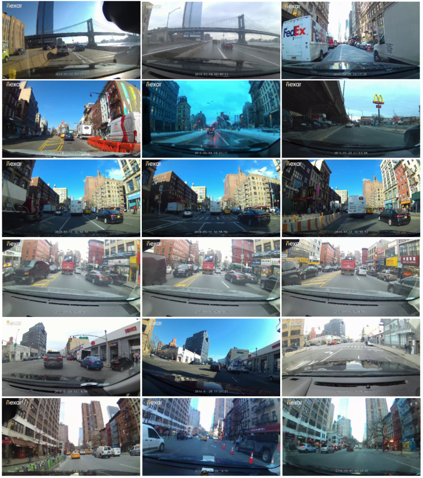

# Nexar-Visual-Localization

Accurate vehicle localization is a crucial step towards building effective Vehicle-to-Vehicle networks and automotive applications. Here, we publish our dataset for training visual localization model, based on real world data. 

_Created by Nexar &reg;_

The full paper describing our work is available on arxiv: [paper](https://arxiv.org/abs/1905.0000)

### ___The full Visual Localization dataset and benchmark will be published here soon. Stay tuned!___

## Contents
1. [Introduction](#introduction)
2. [Dataset](#dataset)
3. [Benchmark](#benchmark)
6. [Citation](#citation)
7. [License](#license)

## Introduction
This dataset is used in our [research paper](https://arxiv.org/abs/1905.0000), which appears in the proceedings for CVPR 2019 Workshop on Autonomous Driving. 
We propose a robust visual localization approach for automotive applications.

## Dataset
Our data was collected from a largescale deployment of connected dashcams. Each vehicle is equipped with a dashacam and a companion smartphone app that continuously captures and uploads sensor data such as GPS readings. The dataset published here contains 1000 video sequences taken at different lighting and weahter conditions in New York City, with their corresponding sensor data. 

## Benchmark
_Coming soon!_

## Citation
If you wish to use our dataset, please use the following bibtex for citation:

	@InProceedings{...,
	  author = {...},
	  title = {Accurate Visual Localization for Automotive Applications},
	  booktitle = {The IEEE Conference on Computer Vision and Pattern Recognition (CVPR)},
	  month = {June},
	  year = {2019}
	}

## License
Copyright [Nexar Inc.](https://getnexar.com/).
